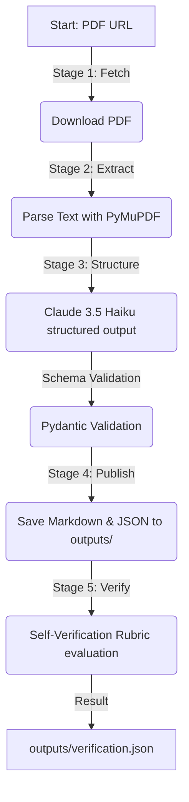

# Document Intelligence Pipeline MVP

An end-to-end MVP designed to ingest a PDF document, extract and structure its content using LLMs, publish the output as a Markdown knowledge page, and run a self-verification pass.

---

## 🛠️ Tech Stack & Architecture



* **LLM**: Anthropic API via `anthropic` SDK (`claude-3-5-haiku-20241022` or `claude-3-5-sonnet-20241022`)
* **Secrets Management**: Infisical CLI
* **Validation**: Pydantic v2
* **Parsing**: PyMuPDF (`fitz`)

---

## 🚀 Getting Started

### 1. Prerequisites
* **Python**: Python 3.10+ installed.
* **Infisical CLI**: Installed and configured with your project.

### 2. Setup & Installation
1. Clone the repository and navigate into the root directory.
2. Initialize and activate a Python virtual environment:
   ```bash
   python -m venv venv
   .\venv\Scripts\activate
   ```
3. Install dependencies:
   ```bash
   pip install -r requirements.txt
   ```

### 3. Injecting Secrets
Ensure your `ANTHROPIC_API_KEY` is loaded into your Infisical environment. The pipeline uses Infisical at runtime to retrieve this secret.

---

## 🏃 Running the Pipeline

To execute the pipeline end-to-end in your terminal:

```bash
infisical.cmd run -- venv\Scripts\python.exe -m app.main
```

### Outputs
Once the run is complete, the following outputs are generated under `/outputs`:
* **[outputs/extracted.json](outputs/extracted.json)**: The structured data output.
* **[outputs/result.md](outputs/result.md)**: The published Markdown page.
* **[outputs/verification.json](outputs/verification.json)**: Self-verification report containing the accuracy score ($>85\%$), hallucinations, and missing details list.

---

## 🔍 Self-Verification Rubric

The verification module evaluates the extracted content against the source text on a **$0\text{ to }100$ scale**:
* **Accuracy (50 pts)**: Factual alignment between extraction and source document.
* **Completeness (30 pts)**: Omission checks on essential dates and data.
* **No Hallucinations (20 pts)**: Penalization for claims not supported by source text.

*Goal: Target an accuracy score $>85\%$ for successful validation.*

---

## ⚠️ Known Issues & Robustness
* **API Rate Limits (429 / 5xx)**: The Anthropic API can occasionally experience spikes in demand or rate limits. The pipeline is equipped with an automatic exponential retry policy in `app/extraction/extractor.py` and `app/verification/verifier.py` to wait and retry before crashing.
