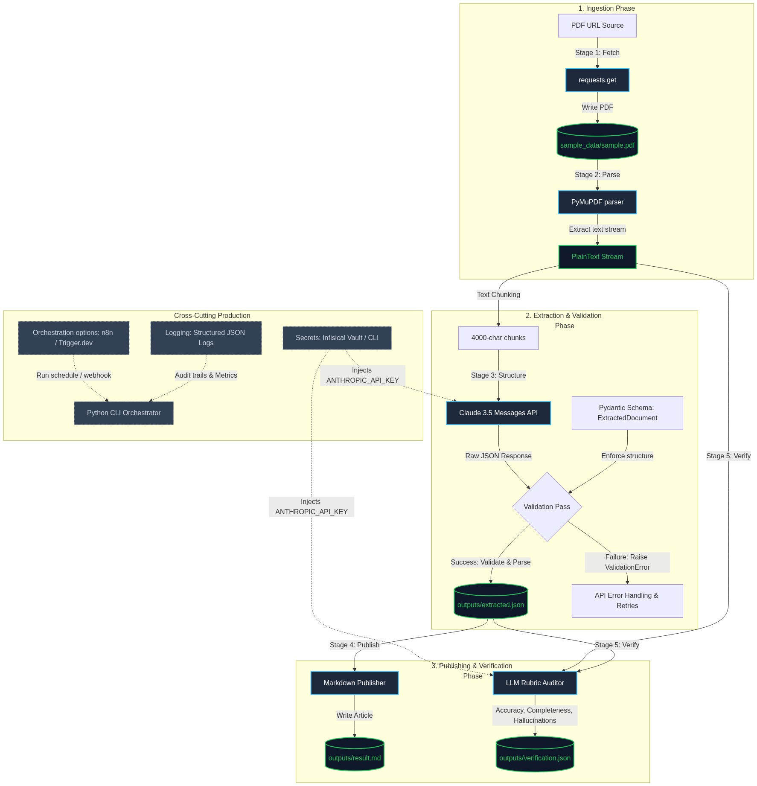

# 📄 Document Intelligence Pipeline MVP

This project is an end-to-end Python-based document intelligence pipeline that ingests a PDF document, extracts structured metadata/risks/claims using Claude 3.5, validates the structure using Pydantic, translates it to a publication-ready Markdown article, and runs a self-verification audit.

* **Live Web App**: https://document-intelligence-pipeline-eosin.vercel.app/
* **Production Orchestrator**: [https://cloud.trigger.dev](https://cloud.trigger.dev)

---

## 🛠️ How It Works (Pipeline Architecture)

Here is a diagram showing the 5 stages of the pipeline and the tools used:



### The 5 Execution Stages:
1. **Stage 1 (Fetch & Ingest)**: Downloads the PDF from a public URL or processes a local PDF upload.
2. **Stage 2 (Parse)**: Extracts layout-aware plaintext from the PDF using PyMuPDF.
3. **Stage 3 (Structure)**: Segments text and queries Claude to extract a structured JSON format, validating the output with **Pydantic v2**.
4. **Stage 4 (Publish)**: Translates the structured JSON into a publication-ready Markdown page.
5. **Stage 5 (Verify)**: Performs a self-verification audit comparison against the source text using an LLM auditor, giving an accuracy score out of 100.

* **💬 Document Q&A Chatbot**: Once the pipeline runs successfully, the raw extracted text is cached locally. The web app includes an interactive chatbot tab that allows you to ask questions about the document in real time. The serverless handler (`api/chat.ts`) sends your question and the document context directly to Claude, delivering instant, verified answers.

---

## 🚀 How to Set Up and Run Locally

Follow these steps to run the pipeline on your computer.

### 1. Prerequisites
* **Python**: You must have Python `3.10` or newer installed.
* **Infisical CLI**: Used to inject API keys securely. You must install the [Infisical CLI](https://infisical.com/docs/cli/usage) and run `infisical login` in your terminal.

### 2. Installation
1. Clone this repository and open a terminal inside the project folder:
   ```bash
   git clone <your-repository-url>
   cd document-intelligence-pipeline
   ```
2. Create a virtual environment and activate it:
   * **Windows (PowerShell)**:
     ```powershell
     python -m venv venv
     .\venv\Scripts\activate
     ```
   * **macOS / Linux**:
     ```bash
     python3 -m venv venv
     source venv/bin/activate
     ```
3. Install the required Python packages:
   ```bash
   pip install -r requirements.txt
   ```

### 3. Run the Pipeline
Run the script using the Infisical CLI to inject the `ANTHROPIC_API_KEY` environment variable:
* **Windows**:
  ```powershell
  infisical.cmd run -- venv\Scripts\python.exe -m app.main
  ```
* **macOS / Linux**:
  ```bash
  infisical run -- venv/bin/python -m app.main
  ```

Once finished, check the generated files inside the `/outputs` folder:
* **[outputs/extracted.json](file:///outputs/extracted.json)**: The structured data extracted from the PDF.
* **[outputs/result.md](file:///outputs/result.md)**: The summary page formatted as Markdown.
* **[outputs/verification.json](file:///outputs/verification.json)**: The self-verification audit report.

---

## 🏃 Running the Web UI Demo Locally

If you want to trigger the pipeline from your web browser:

1. Install the Node.js dependencies:
   ```bash
   npm install
   ```
2. Start the local Trigger.dev dev server:
   ```bash
   npm run trigger:dev
   ```
3. Open the web browser link displayed in your terminal to open the Trigger.dev dashboard.
4. Run the frontend locally (or deploy to Vercel). Paste a PDF URL or upload a local PDF file under 4MB, then click **Trigger Pipeline Run**. The UI polls `/api/status` to show a real-time progress tracker and display the output directly on the webpage!

---

## 🔑 Secret Key Management (Infisical Vault)

To maintain enterprise security standards, this project strictly avoids committing API keys or environment variables directly to code.

* **Local Python execution**: Secrets are injected dynamically at runtime using the **Infisical CLI** (`infisical run`). This pulls the latest variables directly from your Infisical vault into the terminal session memory, leaving no keys on the disk.
* **Vercel Serverless Function**: Configured via Vercel Project Settings (`TRIGGER_SECRET_KEY`).
* **Trigger.dev Task Worker**: Configured via the Trigger.dev Dashboard Settings (`ANTHROPIC_API_KEY`).

---

## 🤖 LLM Configurations & AI Flow

### Model & Parameters:
* **Model**: `claude-haiku-4-5-20251001` (or `claude-3-5-sonnet-20241022`)
* **Temperature**: `0` (Enforces strict determinism for exact facts extraction)
* **Max Tokens**: `4000` (Stage 3 Extraction), `2000` (Stage 5 Verification)

### Pydantic Validation:
In Stage 3, we define the schema as a Pydantic model (`ExtractedDocument` in [schema.py](file:///app/extraction/schema.py)). When the LLM returns a response, the backend instantiates the model `ExtractedDocument(**json.loads(response))`. If Claude returns a wrong type or misses a required field, Pydantic throws a `ValidationError` immediately to avoid passing corrupt data downstream.

### Self-Verification Auditor Rubric:
In Stage 5, the auditor compares the extracted claims against the first 4000 characters of the raw source text. It grades the extraction out of 100 based on three items:
* **Accuracy (50 pts)**: Penalizes points if the extracted evidence quotes are not found verbatim in the source text.
* **Completeness (30 pts)**: Checks if dates, contact details, and risks are correctly cataloged.
* **No Hallucinations (20 pts)**: Checks if the model extracted headers from the Table of Contents that do not exist in the processed text.

---

## 🔧 Troubleshooting & Cloud Deployment Notes

### 1. Python Bundling on Trigger.dev V3
If you deploy this task to Trigger.dev cloud, make sure that your `trigger.config.ts` includes the `scripts` option under the `pythonExtension` builder configuration:
```typescript
pythonExtension({
  requirementsFile: "./requirements.txt",
  scripts: ["app/**/*.py"], // <-- Bundles the Python package into the cloud container
})
```
Without this option, Trigger.dev only copies task entrypoint files, resulting in `ModuleNotFoundError: No module named 'app'` inside the cloud runner.

### 2. Working Directory & File System
Inside containerized environments (like the Trigger.dev Cloud run context), file paths are relative to `/app`. In Stage 01, the pipeline runs `os.makedirs(os.path.dirname(PDF_PATH), exist_ok=True)` unconditionally before attempting to download or copy any PDF files. This prevents `FileNotFoundError: [Errno 2] No such file or directory: 'sample_data/sample.pdf'` during automated runs.

