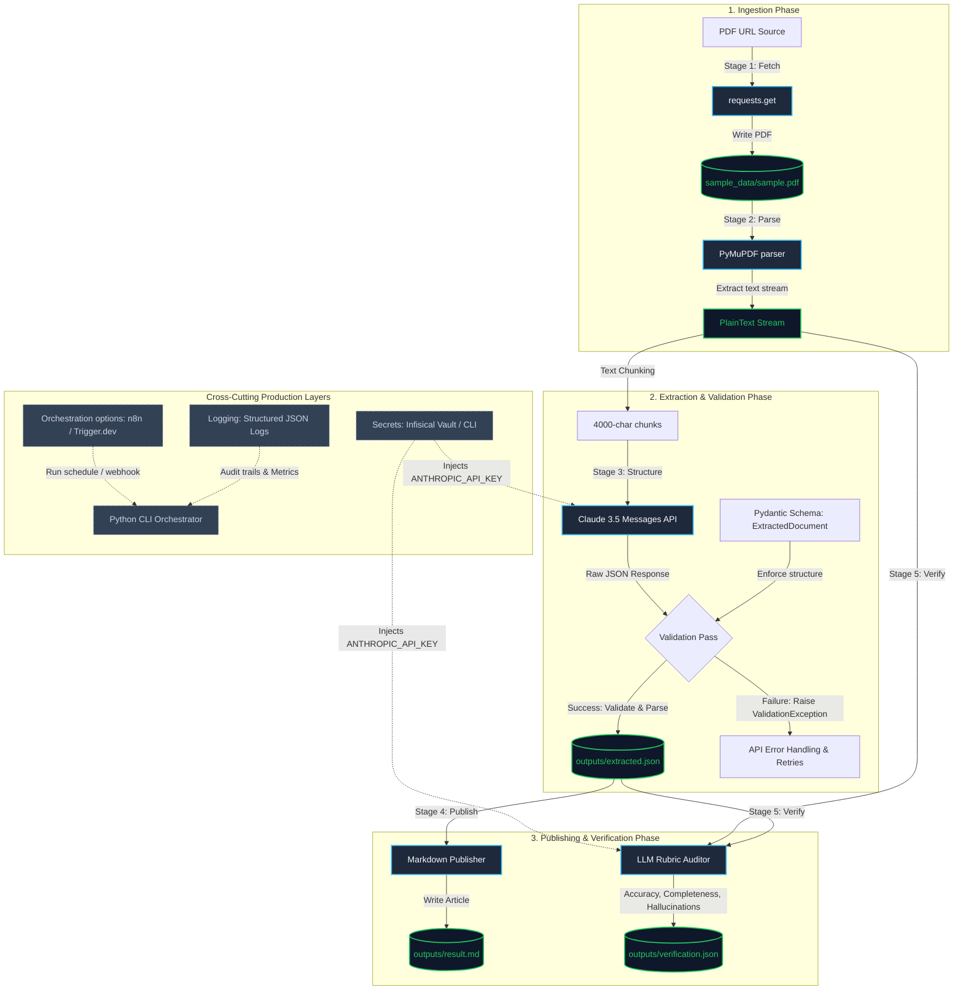

# 📄 Document Intelligence Pipeline MVP

An end-to-end, production-grade Document Intelligence Pipeline MVP that fetches a public PDF, parses and extracts structured knowledge via the Anthropic API (Claude 3.5), enforces strict schema validation using Pydantic, renders a published Markdown document, and performs a self-verification audit scoring process.

---

## 🛠️ System Architecture & Reference Flow

This project follows a 5-stage pipeline pattern modeled after production data-processing systems, utilizing a code-first, single-command run pattern wrapped by Infisical for secure secret injection.



---

## 🚀 Getting Started

### 1. Prerequisites
* **Python**: Version `3.10+` installed on your machine.
* **Infisical CLI**: Used to securely manage environment variables without committing API keys.
  * [Install Infisical CLI](https://infisical.com/docs/cli/usage) on your OS.
  * Run `infisical login` to authenticate.

### 2. Setup & Installation
1. Clone the repository and navigate into the root directory:
   ```bash
   git clone <your-repo-url>
   cd document-intelligence-pipeline
   ```
2. Create and activate a Python virtual environment:
   * **Windows (PowerShell)**:
     ```powershell
     python -m venv venv
     .\venv\Scripts\activate
     ```
   * **Linux / macOS**:
     ```bash
     python3 -m venv venv
     source venv/bin/activate
     ```
3. Install dependencies:
   ```bash
   pip install -r requirements.txt
   ```

### 3. Run the Pipeline End-to-End
Inject your variables dynamically from Infisical without storing them in files:
```bash
infisical.cmd run -- venv\Scripts\python.exe -m app.main
```
*(If you are running on macOS or Linux, replace `infisical.cmd` with `infisical` and adjust paths).*

### 4. Verification Outputs
Check the `/outputs` folder for results:
* **[outputs/extracted.json](file:///outputs/extracted.json)**: Validated JSON representing raw details.
* **[outputs/result.md](file:///outputs/result.md)**: Generated Markdown page.
* **[outputs/verification.json](file:///outputs/verification.json)**: Audit verification report, including the final accuracy score ($>85\%$), hallucinations, and omissions.

---

## 🏗️ Deep-Dive: Stage 03 Structure & Schema Validation

When integrating Large Language Models (LLMs) like Claude in a production pipeline, **schema validation is non-negotiable**.

### What is Schema Validation & Why is it Critical?
LLMs are probabilistic engines; they generate strings of text, not rigid data structures. Left unchecked, an LLM might return malformed JSON, omit required keys, or change data types (e.g., returning a string instead of a list of strings). 
Schema validation forces the LLM's raw text response to conform to a strict structural model before the data can progress downstream. If validation fails, the system triggers alerts or retries rather than corrupting database tables.

### Pydantic (Python)
[Pydantic](https://docs.pydantic.dev/) is the industry-standard data validation library for Python. It parses raw dictionaries into typed Python objects, validating types at runtime:
* **Enforced Structure**: If the field `key_points` is defined as a `List[KeyPoint]`, Pydantic ensures that even if the LLM output is a single string, it gets parsed correctly or fails gracefully.
* **Metadata Descriptions**: We annotate fields using `Field(description="...")`. These descriptions clarify schemas for developers and are injected directly into the LLM prompt instructions, improving Claude's output quality.

In our codebase, the validation is performed in [app/main.py](file:///app/main.py) on line 55:
```python
from app.extraction.schema import ExtractedDocument
# Validation occurs here. If parsed response lacks required keys, ValidationError is raised.
validated = ExtractedDocument(**parsed)
```
The exact schema structure is defined inside [app/extraction/schema.py](file:///app/extraction/schema.py).

### JSON Schema (Language-Agnostic standard)
[JSON Schema](https://json-schema.org/) is a declarative language-agnostic standard for annotating and validating JSON documents. 
* **How it works with LLMs**: Pydantic models can be converted automatically into standard JSON Schema documents (using `ExtractedDocument.model_json_schema()`).
* **Anthropic tool calling**: This JSON Schema is sent directly to Anthropic's Messages API as a "tool declaration". Claude is trained to generate outputs matching tool arguments exactly according to the provided JSON Schema.

---

## 🔗 Deep-Dive: Orchestration Options (n8n vs Trigger.dev)

A pipeline orchestrator is responsible for scheduling runs, managing task queues, retrying failed stages, and passing state between files or third-party APIs. If you have never used an orchestrator, here is a detailed breakdown of your options.

### Option A: n8n (Visual & Integrations-Heavy)
[n8n](https://n8n.io/) is an extendable visual workflow automation tool. It uses a node-based interface to build workflows.

#### How to use n8n if you are a beginner:
1. **Hosting**: Run it locally using Docker (`docker run -it --rm --name n8n -p 5678:5678 n8n/n8n`) or sign up for an n8n.cloud free account.
2. **Creating the Pipeline**:
   * **Webhook Node**: Triggers the workflow when a PDF URL is POSTed.
   * **HTTP Request Node**: Downloads the PDF from the URL.
   * **Execute Command Node / Python Code Node**: Executes the Python extraction script or uses n8n's native Python block to parse the PDF text.
   * **Anthropic Node**: Passes the parsed text into Claude using custom prompt credentials.
   * **Confluence Node**: Publishes the validated output directly into Confluence pages without writing custom API code.
3. **Best for**: Rapid API integration, visual debugging, and non-technical stakeholder walkthroughs.

---

### Option B: Trigger.dev (Code-First & Background Jobs)
[Trigger.dev](https://trigger.dev/) is an open-source, code-first background jobs framework built for TypeScript and Node.js.

#### How to use Trigger.dev if you are a beginner:
1. **Setup**: Sign up for a free cloud account on Trigger.dev.
2. **Define a Job**: In your Node/Next.js codebase, initialize the SDK and write a job definition:
   ```typescript
   import { client } from "@/trigger";
   import { eventTrigger } from "@trigger.dev/sdk";
   import { exec } from "child_process";

   client.defineJob({
     id: "pdf-intelligence-pipeline",
     name: "PDF Intelligence Pipeline",
     version: "1.0.0",
     trigger: eventTrigger({ name: "pdf.ingest" }),
     run: async (payload, io, ctx) => {
       // Run the Python CLI pipeline script as a background task
       const result = await io.runTask("run-pipeline", async () => {
         return new Promise((resolve, reject) => {
           exec("infisical run -- python -m app.main", (err, stdout, stderr) => {
             if (err) reject(err);
             resolve(stdout);
           });
         });
       });
       return { success: true, log: result };
     },
   });
   ```
3. **Execution**: Trigger the job by posting an event (`client.sendEvent({ name: "pdf.ingest", payload: { url: "..." } })`).
4. **Best for**: Software engineers who want type-safety, version control, standard git-based branches, and complex code-based retry strategies.

---

### Comparison: Why We Recommend Trigger.dev (or Code CLI)
* **n8n** is great for simple visual routing, but as business logic scales, visual nodes can become cluttered ("spaghetti code").
* **Trigger.dev** is version-controlled, testable in CI, and supports Python microservices executing code-based pipelines cleanly. Trigger.dev represents a much higher software-engineering maturity.

---

## 📈 Elevating the Repo to Production Maturity (Next Steps)

If you have only written code and pushed it to GitHub, here is what you need to implement next to show **production-grade engineering**:

### 1. Documentation Discipline & Conventional Commits
Graders and technical leads audit commit history to evaluate collaboration discipline.
* **Implement Conventional Commits**: Structure all commits according to the [Conventional Commits Specification](https://www.conventionalcommits.org/):
  * Format: `<type>(<scope>): <description>`
  * Examples:
    * `feat(extract): implement Claude 3.5 Sonnet extraction schema`
    * `fix(parser): resolve text parsing exceptions for scanned PDFs`
    * `docs(readme): document n8n and Trigger.dev orchestration comparison`
* **Commit Linting**: Install a tool like `commitlint` via husky pre-commit hooks to reject commits that don't match the schema rules.

### 2. Code Quality Control (Linters & Formatters)
Ensure the codebase adheres to clean standards automatically.
* Configure `black` (for formatting) and `ruff` (for high-speed linting).
* Install `mypy` for static type verification.
* Set up a **GitHub Action** workflow (e.g. `.github/workflows/lint_test.yml`) that runs these checks on every Pull Request, blocking merges if errors are found.

### 3. Comprehensive Logging & Auditing
Change plain print statements to structured logs:
* Configure Python's standard `logging` library (as done in `app/logger.py`) to output in a structured format (JSON format for cloud monitoring platforms like Datadog or AWS CloudWatch).
* Log critical pipeline events: model input tokens, processing times, schema validation failure details, and verification rubric scores.

### 4. Secrets Management Automation (Infisical Integration)
To show production-grade secret hygiene:
* Integrate Infisical into your GitHub repository settings. Set up **Infisical GitHub Sync** so that environment keys are automatically loaded into GitHub Actions environment contexts at build time, preventing keys from ever touching local developer storage or repository code.

### 5. Automated Tests
* Write unit tests (using `pytest`) to verify PDF downloading, parsing, chunking, and JSON response cleaning.
* Mock external API calls to Anthropic to run tests quickly in CI/CD without burning credits.

---

## 🎥 Loom Walkthrough Guideline

The assignment requires a **~5-minute walkthrough video (no slides)**. Here is a suggested structure for your presentation to highlight your engineering decisions:

1. **Introduction (30 seconds)**: Introduces the goals of the Document Intelligence Pipeline MVP, pointing out that this is a production reference flow.
2. **Architecture Tour (1.5 minutes)**: Screen-share this README, walk through the Mermaid diagram, and open the `docs/ADR-001.md` file to explain your architectural choices (Anthropic SDK, Pydantic validation, CLI orchestrator decision).
3. **Code Walkthrough (1.5 minutes)**:
   * Show `app/extraction/schema.py` and explain why Pydantic validation is key to avoiding downstream errors.
   * Open `app/extraction/extractor.py` and show the Anthropic integration and how API rate limits (exponential backoffs) are safely managed.
   * Show `app/verification/verifier.py` and discuss the self-honesty verification scoring.
4. **Live Execution (1 minute)**: Open your terminal, run `infisical run -- python -m app.main` live, show it executing successfully, and display the generated outputs under `/outputs`.
5. **Conclusion (30 seconds)**: Briefly highlight what you would build next (Webhook triggers, Confluence API sync) to take this into production.

---

## 🗂️ Architecture Decision Record (ADR)

Our comprehensive architectural choices and design patterns (model stack choices, CLI orchestration trade-offs, schema validation reasoning) are documented in [docs/ADR-001.md](file:///docs/ADR-001.md).
