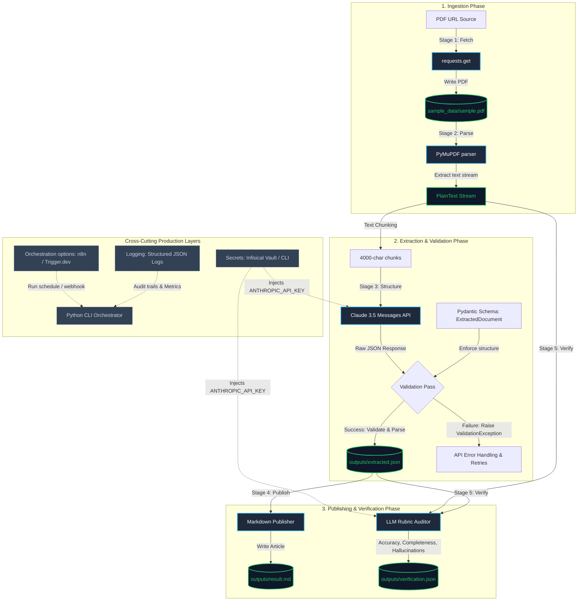

# 📄 Document Intelligence Pipeline MVP

This project is an end-to-end Python pipeline that downloads a PDF, extracts its text, parses structured information using Claude 3.5, validates the structure using Pydantic, and evaluates the final extraction using a self-verification audit.

* **Live Web App**: [https://document-intelligence-pipeline.vercel.app](https://document-intelligence-pipeline.vercel.app)
* **Production Orchestrator**: [https://cloud.trigger.dev](https://cloud.trigger.dev)

---

## 🛠️ How It Works (Pipeline Architecture)

Here is a simple diagram showing the 5 stages of the pipeline and the tools used:



---

## 🚀 How to Set Up and Run Locally

Follow these simple steps to run the pipeline on your computer.

### 1. Prerequisites
* **Python**: You must have Python `3.10` or newer installed.
* **Infisical CLI**: Used to inject API keys securely. You must install the [Infisical CLI](https://infisical.com/docs/cli/usage) and run `infisical login` in your terminal.

### 2. Installation
1. Clone this repository and open a terminal inside the project folder:
   ```bash
   git clone <your-repository-url>
   cd document-intelligence-pipeline
   ```
2. Create a virtual environment and activate it:
   * **Windows (PowerShell)**:
     ```powershell
     python -m venv venv
     .\venv\Scripts\activate
     ```
   * **macOS / Linux**:
     ```bash
     python3 -m venv venv
     source venv/bin/activate
     ```
3. Install the required Python packages:
   ```bash
   pip install -r requirements.txt
   ```

### 3. Run the Pipeline
Run the script using the Infisical CLI to inject the `ANTHROPIC_API_KEY` environment variable:
* **Windows**:
  ```powershell
  infisical.cmd run -- venv\Scripts\python.exe -m app.main
  ```
* **macOS / Linux**:
  ```bash
  infisical run -- venv/bin/python -m app.main
  ```

Once finished, check the generated files inside the `/outputs` folder:
* **[outputs/extracted.json](file:///outputs/extracted.json)**: The structured data extracted from the PDF.
* **[outputs/result.md](file:///outputs/result.md)**: The summary page formatted as Markdown.
* **[outputs/verification.json](file:///outputs/verification.json)**: The self-verification audit report with the accuracy score.

---

## 🏃 Running the Trigger.dev Web UI Demo (Optional)

If you want to trigger the pipeline from your web browser instead of using a terminal command:

1. Install the Node.js dependencies:
   ```bash
   npm install
   ```
2. Start the local Trigger.dev dev server:
   ```bash
   npm run trigger:dev
   ```
3. Wait until you see `○ Local worker ready` in the terminal.
4. Open the web browser link displayed in your terminal to open the Trigger.dev dashboard.
5. In another browser tab, open your Vercel URL, paste a PDF URL, and click **Trigger Pipeline Run**. You can monitor the job executing live from the dashboard, and view the final JSON extraction inside the dashboard **Output** panel!

---

## 🔑 Secret Key Management

To maintain high production standards, this project strictly avoids committing API keys or environment variables directly to code. The required keys and their environments are outlined below.

### Required Secrets
1. **`ANTHROPIC_API_KEY`**: 
   * **Purpose**: Used by the Python backend script to query Claude 3.5 for structured extraction and audit verification.
   * **Provider**: Retrieve this from the [Anthropic Console](https://console.anthropic.com/).
2. **`TRIGGER_SECRET_KEY`**: 
   * **Purpose**: Used by the Vercel serverless dispatch function (`api/trigger.ts`) to securely communicate with the Trigger.dev Cloud API.
   * **Provider**: Retrieve this from your [Trigger.dev Dashboard](https://cloud.trigger.dev/) under *API Keys*.

### Setup & Configurations
Secrets are mapped across three environments to maintain security isolation:

* **Local Python CLI execution**: Injected dynamically at runtime using the **Infisical CLI** (`infisical run`). This pulls the latest variables directly from your Infisical vault into the terminal session.
* **Vercel Serverless Deployment**: Configured via the Vercel Project Settings under *Environment Variables* (`TRIGGER_SECRET_KEY`).
* **Trigger.dev Task Worker**: Configured via the Trigger.dev Dashboard settings under *Environment Variables* (`ANTHROPIC_API_KEY`).

---

## 💡 Key Architectural Details

### Stage 03: Pydantic Schema Validation
LLMs are probabilistic and can sometimes return malformed JSON or miss fields.
We use **Pydantic v2** (`ExtractedDocument` in [schema.py](file:///app/extraction/schema.py)) to parse and validate Claude's outputs at runtime. If Claude's response is missing a required key or returns a wrong type, Pydantic immediately raises a `ValidationError` to prevent broken data from saving.

### Orchestration Choice: Trigger.dev vs. n8n
* **n8n**: A visual, drag-and-drop workflow tool. While n8n is great for simple connections, it is harder to review in Git and is not suited for complex Python logic like PDF parsing or Pydantic validation.
* **Trigger.dev**: A code-first background task runner. Because it is written in TypeScript, it lives inside our Git repository, supports type safety, handles long-running jobs (solving Vercel's 10-second serverless timeout limit), and integrates seamlessly with our Python scripts.
